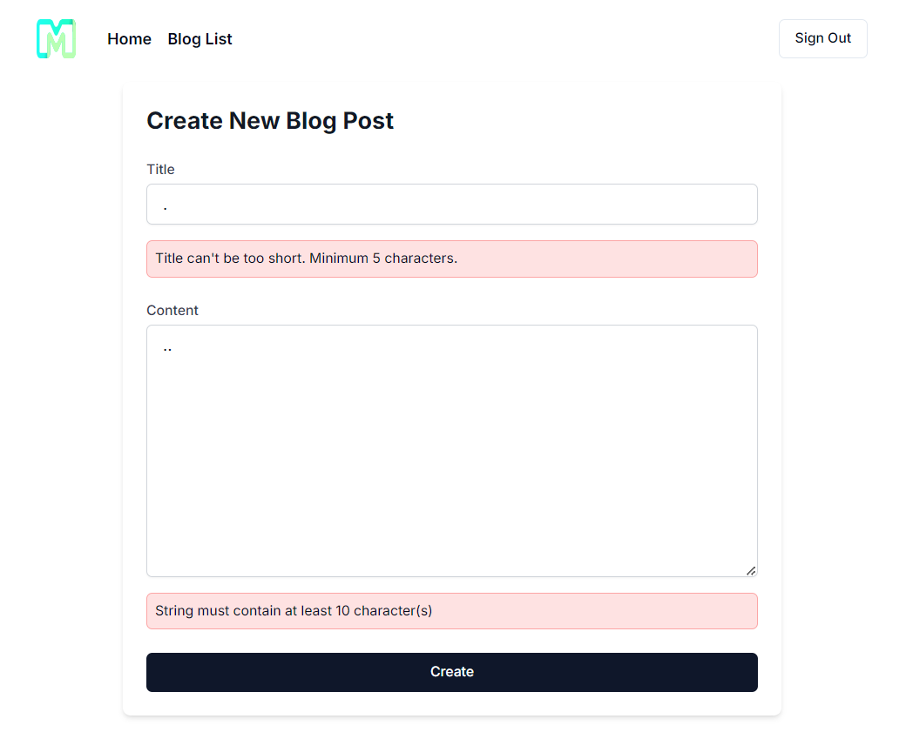

# Example Site

Neon Max comes packaged with an example blog application that you can go through to get familiar with all the tools that comes with the starter kit as well as Neon Max's own unique functionalities and helpers. This section will help you go through the example application and explain each parts.

## The Blog Site

The example website is pretty simple. It's basically a blog app where authenticated users can view, create, update, and delete blogs (or blog posts). It comes with implementations of Neon Max's Authorization helper, so only creators of a blog (blog post) can manipulate it (delete, update, etc.).

## Structure

All the example code are included inside `app/examples/blog`. There are four pages:

- `app/examples/blog/page.tsx` → A list of all the blogs created by users.
- `app/examples/blog/create/page.tsx` → A page for users to create their blogs.
- `app/examples/blog/[id]/page.tsx` → A detail view of a particular blog post. This is where comments of a blog is shown and created.
- `app/examples/blog/[id]/edit/page.tsx` → A page for users to update/edit theri blog.

## Models

To support the functionalities of the example site, under `prisma/schema.prisma`, you will se some existing models:

- `User` → An important model used for authentication. Also used to determine the creator of a particular blog.
- `Blog` → The blog itself.
- `Comment` → For comments associated with a blog. Each blog has many comments.

## Code

### Server Actions

At `app/examples/blog/page.tsx` you can see an example of a server action... in action!

```typescript
import { getBlogs } from "@/actions/blog";

const blogs = await getBlogs();
```

And if I go to `actions/blog`:

```typescript
"use server";

// Retrieve all blogs
export async function getBlogs(): Promise<Blog[]> {
  const blogs = await prisma.blog.findMany({
    include: {
      author: true,
    },
    orderBy: {
      createdAt: "desc",
    },
  });
  return blogs;
}
```

As indicated by `"use server"`, the exported functions in this file are server actions. This means the code runs on the server; that's why I can safely access prisma here. Also because this is a server component, I can immediately use the `blogs` variable and render the contents in the same `app/examples/blog/page.tsx` file.

```tsx
<div className="bg-white shadow-sm rounded-lg">
  {blogs.length === 0 ? (
    <p className="text-gray-500">
      No blogs available. Please create a new one.
    </p>
  ) : (
    <ul className="flex flex-col gap-2 ">
      {blogs.map(async (blog) => (
        <li key={blog.id} className="p-4 border border-gray-200 rounded-md ">
          <div className="flex justify-between items-center">
            <div>
              <h2 className="text-lg font-semibold text-gray-800">
                {blog.title}
              </h2>
              <p className="text-gray-600 text-sm">
                {blog.content.substring(0, 100)}...
              </p>
            </div>
            <div className="flex space-x-3">
              <Link
                href={`/examples/blog/${blog.id}`}
                className={cn(
                  buttonVariants({ variant: "outline", size: "icon" })
                )}
              >
                <Eye className="h-4 w-4" />
              </Link>

              {(await Authorization.allows("can-edit-blog", blog.id)) && (
                <>
                  <Link
                    href={`/examples/blog/${blog.id}/edit`}
                    className={cn(
                      buttonVariants({ variant: "outline", size: "icon" })
                    )}
                  >
                    <Pencil className="h-4 w-4" />
                  </Link>
                  <form action={handleDelete} className="inline-block">
                    <input type="hidden" name="id" value={blog.id} />
                    <Button type="submit" variant="destructive" size="icon">
                      <Trash className="h-4 w-4" />
                    </Button>
                  </form>
                </>
              )}
            </div>
          </div>
        </li>
      ))}
    </ul>
  )}
</div>
```

### Authorization and Policy

There's a lot to unpack here. Firstly, the authorization check with `Authorization.allows()`. `Authorization` is a helper class that lets you register policies based on the authenticated user. In the example, `Authorization.allows("can-edit-blog")` checks the app's list of policies/authorizations to see if a `"can-edit-blog"` policy exists, and, if it does, does the configured check based on the user.

If you head over to `config/authorization.ts`, you'll see the list of preconfigured policies. Right now it only has `"can-edit-blog"`. And that's exatcly what's being used. If `Authorization.allows("can-edit-blog")` returns `true` for the current authenticated user, it will display the "delete" and "edit" buttons.

Let's see what this policy is. Inside `config/authorization.ts`, I can see the entry for `"can-edit-blog"`:

```tsx
export const AUTHORIZATIONS: Record<
  string,
  (user: User, ...args: any[]) => Promise<boolean>
> = {
  "can-edit-blog": async (user, blogId: number) => {
    const blog = await getBlogById(blogId);

    if (blog && blog.authorId === user.id) return true;

    return false;
  },
};
```

As you can see, this authorization checks if a user is the owner of a blog with the provided id by checking `user.id` with `blog.authorId`. If it doesn't match, it return false. Meaning the user cannot perform the action. This is an example of using the `Authorization` helper class. For more information on it, go to the ["authorization"](/docs/concepts/authorization) section.

### Protected Page

If you head over to `app/examples/blog/create/page.tsx`, you'll find this piece of code:

```typescript
await Auth.authenticated();
```

This code uses the `Auth` helper class to prevent unaunthenticated users to visit this page. What this method does is check if there's an active session (meaning the current user is logged in), and if there isn't, redirect the user to the login page defined at `config/auth.ts`.

### Validation and `Errors` Helper

In `app/examples/blog/create/page.tsx`, there's a server action directly defined inside the server component:

```typescript
async function handleCreate(formData: FormData) {
  "use server";
  const title = formData.get("title") as string;
  const content = formData.get("content") as string;

  const validationResult = Errors.validateZod(blogSchema, { title, content });

  if (!validationResult.error) {
    await createBlog(title, content);
    revalidatePath("/examples/blog");

    redirect("/examples/blog");
  } else {
    redirect("/examples/blog/create");
  }
}
```

This server action calls another server action `createBlog`. It should be noted that the logic inside this server action could've easily have been included right in `createBlog`, but this code is meant to highlight that you can create server actions in many places.

But the more important part to look at here is the use of the `Errors` helper under `lib/errors.ts` to validate the values from the form to create the blog before passing it over to `createBlog`. As you can see there's the line `const validationResult = Errors.validateZod(blogSchema, { title, content })`. This code takes in a `zod` schema and one or more values to validate against the said schema.

It should be noted that this helper method should only be called on the server. Under the hood, what this method does is send `errors` cookies, which will have properties based on the schema on which `validateZod` was used.

For example, the above `handleCreate` action checks if the method returns any error. If it does return an error, `validateZod` will have already set the cookies to be used in the next request and the user will be redirected back to the create blog page. Inside this page, we will anticipate that we might have some `errors` cookies:

```tsx
<ErrorMessage message={Errors.get("title")} className="mt-4" />
<ErrorMessage message={Errors.get("content")} className="mt-4" />
```

Neon Max provides a conveniennt component to display errors called `ErrorMessage`. But a more important part of the above code is the use of the `Errors.get()` method. This directly corresponds to the `validateZod` schema method. In the `handleCreate` method, we validate the fields `name` and `content` against a schema. If validation fails on either of those fields, we well get corresponding errors via the `errors` cookies. We can access these error messages with `Errors.get()` as has been used to supply `ErrorMessage`s message property.

If you fail a validation against the schema, you will see something like this:



### Client Component

All of the examples so far have been in server components, but in `app/examples/blog/Comments.ts`, you'll find a client component named `Comments`. This component could've very easily been created as a server component but is included to show that client components are also easy to build with.

#### Prisma Type Extraction

A pretty neat feature by Prisma that should be mention is the ability to extract a type based on a query to the database. The `comments` state is declared as the type:

```typescript
Prisma.CommentGetPayload<{
   include: {
   author: {
       select: {
       name: true;
       };
   };
   };
}>[]
```

This is a direct reflection of what I use to fill `setComments`:

```typescript
const comments = await getAllComments(blogId);
setComments(comments);
```

`getAllComments` is a server action:

```typescript
// Get all Comments
export async function getAllComments(blogId: number) {
  const comments = await prisma.comment.findMany({
    where: {
      blogId,
    },
    include: {
      author: {
        select: {
          name: true,
        },
      },
    },
  });
  return comments;
}
```

As you can see the query is the same as the type defined for `comments` state. You get `CommentGetPayload` and provide it with the query you plan to fill that state with. In the example, comments are fetched as well as their corresponding authors, but the author's other fields are not necessary; that's why the query is limited using `select` to only return the author's name.

#### `useSession` to Get Session User in Client Components

This section is just to highlight that you can use NextAuth's `useSession()` to fetch the currently logged in user (if there's any). In the `Comments` component, only `status` (returned from `useSession`) is used to determin if the current user is authenticated. If they are, the form to create comments is displayed; otherwise the user will be prompted to login.
