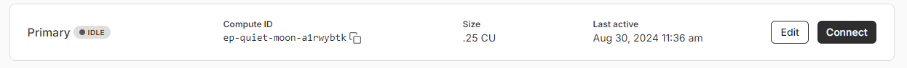

# Getting Started

### What you'll need

- [Node.js](https://nodejs.org/en/download/) version 18.0 or above:
  - When installing Node.js, you are recommended to check all checkboxes related to dependencies.

### Cloning the Starter Kit

To start building with Neon Max by cloning the starter kit at https://github.com/AnsellMaximilian/neon-nextjs-max-starter-kit and installing all the necessary dependencies.

```bash
git clone https://github.com/AnsellMaximilian/neon-nextjs-max-starter-kit.git custom-name
npm install
```

### Environment Variables

There are a couple of environment variables that are required before starting your development. Namely, a NextAuth secret and your Neon database URL.

There's an example `.env.example` file that you can copy to get started

```bash
cp .env.example .env
```

This new `.env` file will be where you'll store environment variables.

Next, generate a NextAuth secret with:

```bash
npx auth secret
```

You'll also need a database URL, we'll get to that in the following section.

### Preparing Neon

Next, you'll need to connect your Next.js repo with a Neon database.

If you don't have a Neon account yet, you can sign up [here](https://console.neon.tech/signup). Otherwise, login and head over to Neon's [console](https://console.neon.tech/).

Follow this [comprehensive project creation tutorial by Neon](https://neon.tech/docs/get-started-with-neon/signing-up) until you have a development database.

Once you have a development database, get its connection string by heading over to your Neon console, clicking **branches** on the sidebar, then clicking your dev branch. Then, click **connect** to look at your connection string:



A modal will open up with your connection string. Copy that string and paste it into your `.env.` file for the DATABASE_URL entry. Make sure you copy the database password too (this file will be ignored in git).

### Configure Prisma

Once you have your database url set in the `.env` file, you can start configuring prisma. Start by generating the initial migration:

```bash
npx prisma migrate dev --name init #or any other name
```

This command generates migration files written in SQL corresponding to our schema definitions and applies them to create the tables in your Neon database. We used the --name flag to name the migration. Now your neon development database will match the models defined in `./prisma/prisma.schema`.

## Start your site

Run the your Next.js website:

```bash
npm run dev
```

Next, head over to http://localhost:3000
