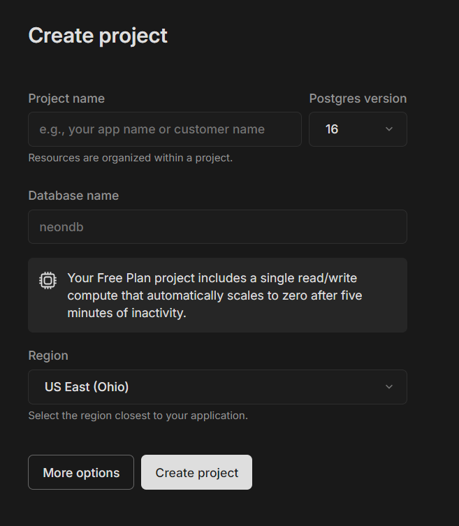
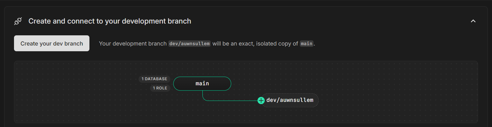
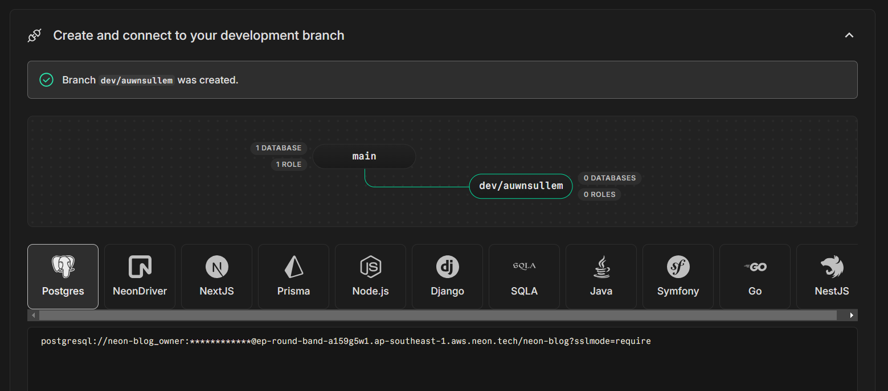

# Setting Up Neon

Neon already provides a copmprehensive [tutorial on how to get started](https://neon.tech/docs/get-started-with-neon/), and they even dive into using their CLI tool to interact with your project including creating branches and using `psql` to write queries straight into your serverless database.

However, I will provide my own tutorial here as an alternative. To avoid redundant information, I will write this tutorial without using their CLI tool but instead use their UI fully.

## Sign Up

You will need to either sign up or login into Neon's console. If you've signed up and logged in, you can skip this part. Otherwise, head over to https://console.neon.tech/signup, and create an account.

## Creating a Project

Head over to !link here!. If you don't have any project in your account, you will immediately be prompted to craete one. Fill out the details of your project including project name, database name, as well as the region. Then, create your project.

Neon then will create your project along with your database. Neon organizes your databases in **branches**, similar to git. And, by default, you will have a `main` branch. This should be your production branch.

As suggested by Neon, you should create a seperate development branch while developing. As seen in the image above, Neon has provided a quick way for you to create your first dev branch. Click on `dev/<your username>`. This will automatically create a new branch, branching off your `main` branch.

You will now be able to see your database URL for that particular `dev` branch. Copy that URL string and keep it handy. You will need it for Neon Max. You're now ready to connect Neon Max to your database.
